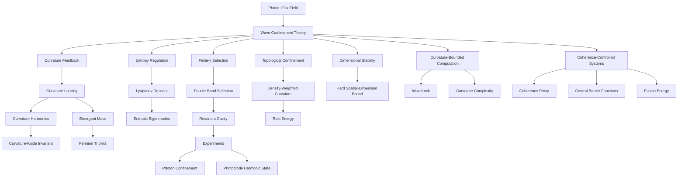

# Glossary Overview Map

This map organizes the WCT glossary as a navigable concept system rather than an alphabetical list. Each linked definition note contains its papers and related concepts; the **WCT Graph** adds an interactive local map for every term.

## Interactive use

1. Open **WCT Graph**.
2. Select **Glossary** in the overview.
3. Click a definition node to read its expanded definition and corpus role.
4. Select **Map connections** to see its local network of related definitions, papers, equations, maps, and references.

## Core dependency map



## Foundations and field structure

- [[Research/02 Concepts/Wave Confinement Theory|Wave Confinement Theory]]
- [[Research/02 Concepts/Phase-Flux Field|Phase–Flux Field]]
- [[Research/02 Concepts/Curvature Feedback|Curvature Feedback]]
- [[Research/02 Concepts/Curvature Locking|Curvature Locking]]
- [[Research/02 Concepts/Entropy regulation|Entropy regulation]]
- [[Research/02 Concepts/Lyapunov Descent|Lyapunov Descent]]
- [[Research/02 Concepts/Finite-k Selection|Finite-k Selection]]
- [[Research/02 Concepts/Fourier Band Selection|Fourier Band Selection]]
- [[Research/02 Concepts/Topological Confinement|Topological Confinement]]

## Matter, mass, and geometry

- [[Research/02 Concepts/Emergent Mass|Emergent Mass]]
- [[Research/02 Concepts/Density-Weighted Curvature|Density-Weighted Curvature]]
- [[Research/02 Concepts/Curvature Harmonics|Curvature Harmonics]]
- [[Research/02 Concepts/Curvature-Koide Invariant|Curvature-Koide Invariant]]
- [[Research/02 Concepts/Fermion Triplets|Fermion Triplets]]
- [[Research/02 Concepts/Effective Metric|Effective Metric]]
- [[Research/02 Concepts/Dimensional Stability|Dimensional Stability]]

## Spectral and particle tests

- [[Research/02 Concepts/Discrete Scale Invariance|Discrete Scale Invariance]]
- [[Research/02 Concepts/Log-periodic structure|Log-periodic structure]]
- [[Research/02 Concepts/C9(q2)|C₉(q²)]]
- [[Research/02 Concepts/B0 → K star 0 μ+μ−|B⁰ → K*⁰ μ⁺μ⁻]]
- [[Research/02 Concepts/Atomic spectra|Atomic spectra]]
- [[Research/02 Concepts/Detector Resolution|Detector Resolution]]
- [[Research/02 Concepts/Curvature-Induced Mass Shift|Curvature-Induced Mass Shift]]

## Experiments and measurement

- [[Research/02 Concepts/Experimental ledger|Experimental ledger]]
- [[Research/02 Concepts/Experimental Sensitivity|Experimental Sensitivity]]
- [[Research/02 Concepts/Photon Confinement|Photon Confinement]]
- [[Research/02 Concepts/Angular modulation|Angular modulation]]
- [[Research/02 Concepts/Energy Smearing|Energy Smearing]]

## Computation, cryptography, and AI

- [[Research/02 Concepts/Curvature-Bounded Computation|Curvature-Bounded Computation]]
- [[Research/02 Concepts/Curvature complexity|Curvature complexity]]
- [[Research/02 Concepts/Curvature-based cryptography|Curvature-based cryptography]]
- [[Research/02 Concepts/Computational Complexity|Computational Complexity]]
- [[Research/02 Concepts/Agent drift|Agent drift]]
- [[Research/02 Concepts/Constraint drift|Constraint drift]]
- [[Research/02 Concepts/Coherence mirage|Coherence mirage]]
- [[Research/02 Concepts/Collapse score|Collapse score]]

## Fusion and control

- [[Research/02 Concepts/Fusion Energy|Fusion Energy]]
- [[Research/02 Concepts/Coherence proxy|Coherence proxy]]
- [[Research/02 Concepts/Energy balance|Energy balance]]
- [[Research/02 Concepts/Control barrier functions|Control barrier functions]]
- [[Research/02 Concepts/Real-time plasma control|Real-time plasma control]]
- [[Research/02 Concepts/MHD Stabilization|MHD Stabilization]]

## Complete alphabetical glossary

- [[Research/03 Glossary/WCT Glossary|WCT Glossary]]
- [[Research/00 Maps/Concept Index|Concept Index]]

## All definition notes

```dataview
TABLE WITHOUT ID
  file.link AS "Definition",
  paper_count AS "Papers"
FROM "Research/02 Concepts"
SORT file.name ASC
```
