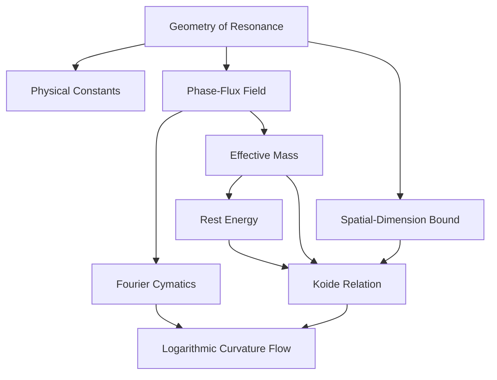
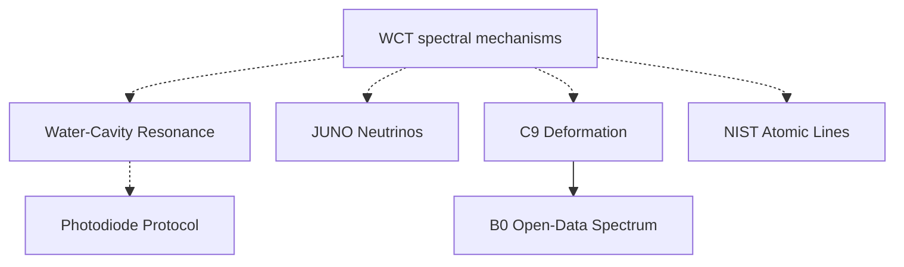
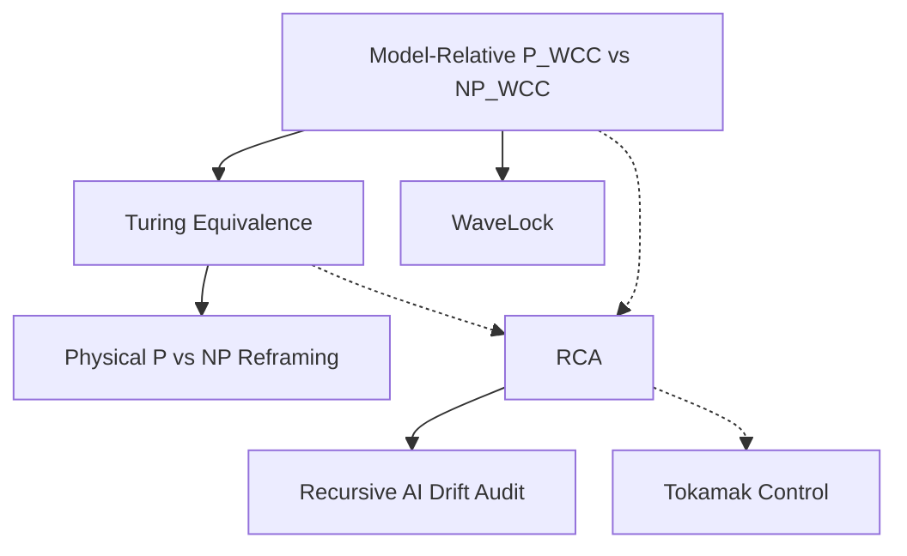
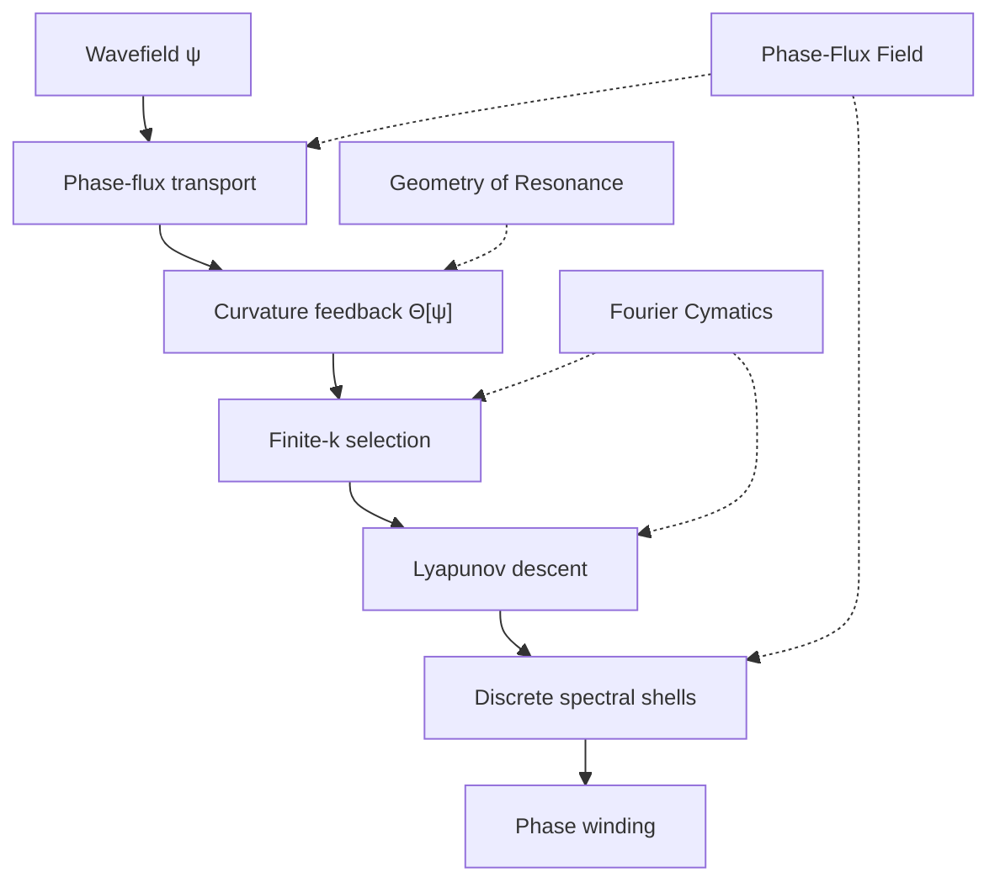
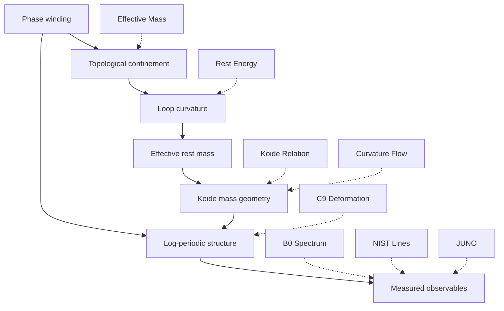
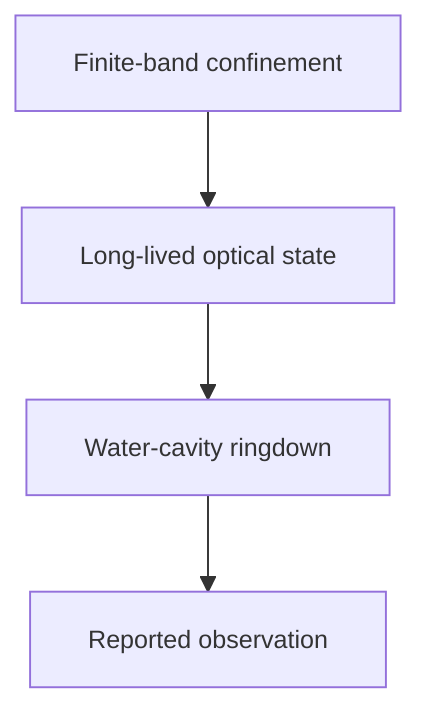
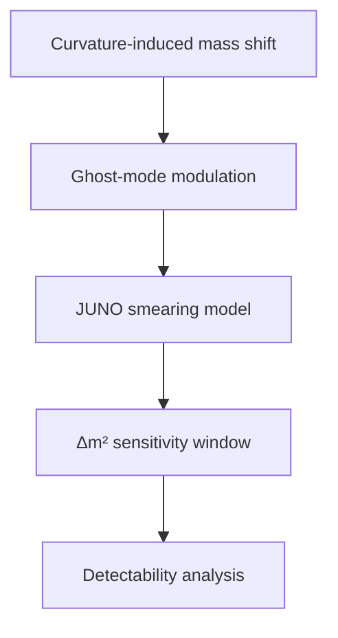
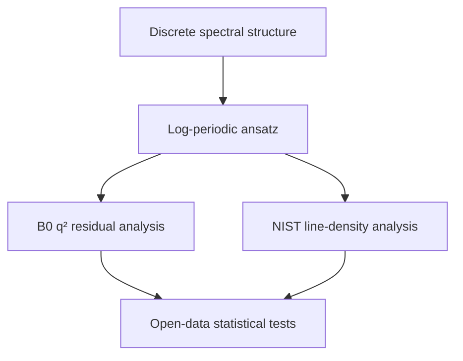
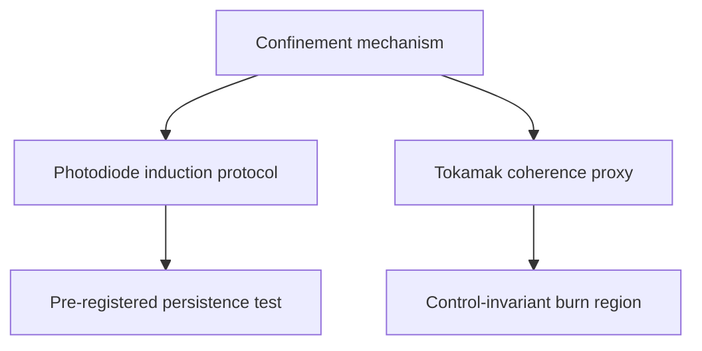
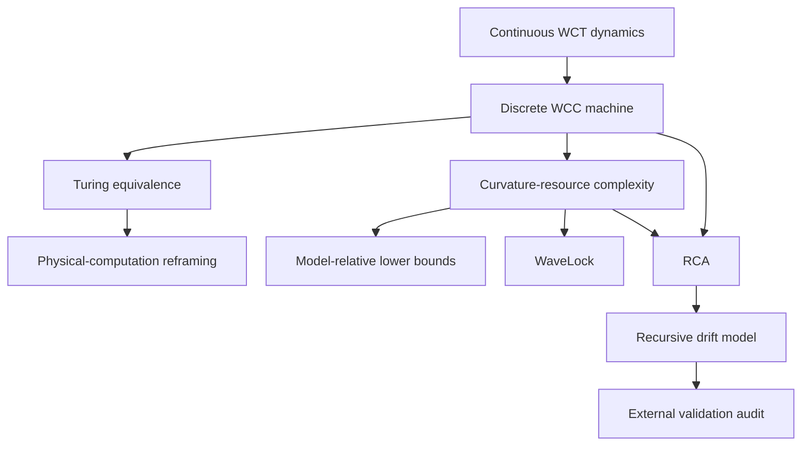

# Research Knowledge Map

  

  

This map organizes the 22-paper research program by **branch, derivation dependency, shared mechanism, empirical status, and chronology**.

  

  

> [!note] Map semantics

  

> - A solid arrow `A --> B` means **B directly builds on, specializes, or tests A**.

  

> - A dashed arrow `A -.-> B` means **conceptual or methodological support**, not a complete derivation.

  

> - Collection nodes organize papers; they do not imply that every paper in a collection proves every claim associated with that collection.

  

> - Mermaid diagrams are visual indexes. The wikilink sections below provide the Obsidian navigation layer.

  

  

---

  

  

## 1. Program architecture

  

The full architecture is split into smaller vertical maps so each diagram fits inside the Obsidian reading pane.

  

### 1.1 Foundations and field theory

  

  

### 1.2 Experiments and spectral tests

  

  

### 1.3 Computation, AI, and control

  

  
  

---

  

  

## 2. Core mechanism map

  

The mechanism chain is divided into two stages.

  

### 2.1 Field organization

  

  

### 2.2 Confinement, mass, and observables

  

  
  

---

  

  

## 3. Theory-to-evidence pipeline

  

Each evidence route is shown as a separate compact chain.

  

### 3.1 Optical confinement

  

  

### 3.2 Neutrino detectability

  

  

### 3.3 Collider and atomic spectra

  

  

### 3.4 Protocol and control proposals

  

  
  

---

  

  

## 4. Computation and AI branch

  

  
  

---

  

  

## 5. Chronology and program growth

  

| Date | Publications |

|---|---|

| 2025-04 | The Geometry of Resonance; Physical Constants through Wave Confinement |

| 2025-05 | Long-Lived Photon Resonance in Water Cavities; Model-Relative P_WCC vs NP_WCC |

| 2025-06 | Resonance-Confinement Architecture |

| 2025-08 | Spatial Dimensionality Bound |

| 2025-09 | Phase-Flux Field; Self-Emergent Fourier Cymatics |

| 2025-10 | Solenoidal Topology and Effective Mass |

| 2025-11 | Rest Energy from Loop Curvature; JUNO Ghost-Mode Neutrinos; Wave-Constrained Computation and Turing Equivalence |

| 2025-12 | WCT and the Koide Mass Relation; WaveLock; Classical P vs NP Is Ill-Posed; Photodiode Protocol Ledger |

| 2026-03 | Logarithmic Curvature Flow and Lepton Masses |

| 2026-04 | Log-Periodic C9 Deformation; Self-Sustaining Resonance Tokamak |

| 2026-05 | Log-Spectral Structure in B0 Decays; Recursive AI Drift Audit; NIST Atomic Line Log-Periodicity |

  
  

---

  

  

## 6. Branch navigation

  

  

### Foundations and field theory

  

  

- [[The Geometry of Resonance]]

  

- [[Structure and Derivation of Physical Constants through Wave Confinement]]

  

- [[Phase-Flux Field]]

  

- [[Self-Emergent Fourier Cymatics]]

  

- [[Hard Upper Bound on Spatial Dimensionality in Wave Confinement Theory]]

  

- [[Emergence of Effective Mass - Solenoidal Topology of Vibrational Energy]]

  

- [[Rest Energy from Density-Weighted Loop Curvature]]

  

- [[Wave Confinement Theory Predicts the Koide Mass Relation]]

  

- [[Logarithmic Curvature Flow, Filament Localization, and the Geometric Origin of the Lepton Mass Spectrum]]

  

  

**Central concepts:** [[02 Concepts/Wave Confinement Theory|Wave Confinement Theory]], [[02 Concepts/Phase-Flux Field|Phase-Flux Field]], [[02 Concepts/Curvature Feedback|Curvature Feedback]], [[02 Concepts/Finite-k Selection|Finite-k Selection]], [[02 Concepts/Lyapunov Descent|Lyapunov Descent]], [[02 Concepts/Shell Quantization|Shell Quantization]], [[02 Concepts/Topological Confinement|Topological Confinement]], [[02 Concepts/Emergent Mass|Emergent Mass]], [[02 Concepts/Rest Energy|Rest Energy]].

  

  

### Experiments and protocols

  

  

- [[Observation of Long-Lived Photon Resonance Confinement in Water Cavities]]

  

- [[JUNO Energy Resolution and Detectability of WCT Ghost-Mode Neutrinos]]

  

- [[Prediction & Protocol Ledger - Long-Lived Harmonic State Induction in Photodiodes]]

  

  

**Central concepts:** [[02 Concepts/Long-Lived Resonance|Long-Lived Resonance]], [[02 Concepts/Optical coherence|Optical Coherence]], [[02 Concepts/Detector Resolution|Detector Resolution]], [[02 Concepts/Energy Smearing|Energy Smearing]], [[02 Concepts/Δm2 precision|Δm² Precision]], [[02 Concepts/Experimental Sensitivity|Experimental Sensitivity]], [[02 Concepts/Protocol registration|Protocol Registration]], [[02 Concepts/Falsifiable Predictions|Falsifiable Predictions]].

  

  

### Particle physics and spectral tests

  

  

- [[A Curvature-Induced Log-Periodic Deformation of C9(q2)]]

  

- [[Log-Spectral Structure and Koide-Like Winding Geometry in Open-Data B0 Decays]]

  

- [[Bin-Stable Log-Periodic Structure in Public NIST Atomic Line Lists]]

  

- [[Wave Confinement Theory Predicts the Koide Mass Relation]]

  

- [[Logarithmic Curvature Flow, Filament Localization, and the Geometric Origin of the Lepton Mass Spectrum]]

  

- [[Rest Energy from Density-Weighted Loop Curvature]]

  

- [[JUNO Energy Resolution and Detectability of WCT Ghost-Mode Neutrinos]]

  

  

**Central concepts:** [[02 Concepts/Log-periodicity|Log-Periodicity]], [[02 Concepts/Discrete Scale Invariance|Discrete Scale Invariance]], [[02 Concepts/Active-domain winding|Active-Domain Winding]], [[02 Concepts/Koide Relation|Koide Relation]], [[02 Concepts/Wilson Coefficient C9|Wilson Coefficient C₉]], [[02 Concepts/Neutrino Oscillations|Neutrino Oscillations]], [[02 Concepts/Mass-Squared Difference|Mass-Squared Difference]].

  

  

### Computation and cryptography

  

  

- [[P vs NP in Curvature-Bounded Wave Computation]]

  

- [[Discrete Wave-Constrained Computation and Classical Complexity]]

  

- [[The Classical P vs NP Problem Is Mathematically and Physically Ill-Posed]]

  

- [[WaveLock - A Curvature-Locked One-Way Function Based on Nonlinear PDE Evolution]]

  

  

**Central concepts:** [[02 Concepts/Wave Curvature Computation|Wave Curvature Computation]], [[02 Concepts/Curvature complexity|Curvature Complexity]], [[02 Concepts/Curvature Capacity|Curvature Capacity]], [[02 Concepts/Turing Equivalence|Turing Equivalence]], [[02 Concepts/Physical Computation|Physical Computation]], [[02 Concepts/One-Way Functions|One-Way Functions]].

  

  

### AI safety and architecture

  

  

- [[Resonance-Confinement Architecture - A Physically Bounded Substrate for Safe Superintelligence]]

  

- [[Recursive AI Drift - A 2025 Prediction Timeline External Validation Audit and Technical Note]]

  

  

**Central concepts:** [[02 Concepts/Resonance-Confinement Architecture|Resonance-Confinement Architecture]], [[02 Concepts/Coherence mirage|Coherence Mirage]], [[02 Concepts/Semantic anchor decay|Semantic Anchor Decay]], [[02 Concepts/Recursive degradation|Recursive Degradation]], [[02 Concepts/Agent drift|Agent Drift]], [[02 Concepts/Verifier gaming|Verifier Gaming]], [[02 Concepts/Emergent misalignment|Emergent Misalignment]].

  

  

### Fusion and control

  

  

- [[Nuclear Fusion Tokamak with Self Sustaining Resonance]]

  

  

**Central concepts:** [[02 Concepts/Plasma confinement|Plasma Confinement]], [[02 Concepts/Coherence proxy|Coherence Proxy]], [[02 Concepts/Energy balance|Energy Balance]], [[02 Concepts/Control barrier functions|Control Barrier Functions]], [[02 Concepts/Lyapunov Stability|Lyapunov Stability]], [[02 Concepts/MHD Stabilization|MHD Stabilization]], [[02 Concepts/SPARC|SPARC]].

  

  

---

  

  

## 7. Navigation by research question

  

  

| Question | Start here | Continue to |

  

|---|---|---|

  

| What is the minimal WCT substrate? | [[Phase-Flux Field]] | [[The Geometry of Resonance]], [[Self-Emergent Fourier Cymatics]] |

  

| How are modes selected from disorder? | [[Self-Emergent Fourier Cymatics]] | [[02 Concepts/Finite-k Selection|Finite-k Selection]], [[02 Concepts/Spectral Entropy|Spectral Entropy]] |

  

| Why three large spatial dimensions? | [[Hard Upper Bound on Spatial Dimensionality in Wave Confinement Theory]] | [[02 Concepts/Laplacian Scaling|Laplacian Scaling]], [[02 Concepts/Dimensional Stability|Dimensional Stability]] |

  

| How does confinement produce mass? | [[Emergence of Effective Mass - Solenoidal Topology of Vibrational Energy]] | [[Rest Energy from Density-Weighted Loop Curvature]] |

  

| How are lepton mass ratios organized? | [[Wave Confinement Theory Predicts the Koide Mass Relation]] | [[Logarithmic Curvature Flow, Filament Localization, and the Geometric Origin of the Lepton Mass Spectrum]] |

  

| What are the strongest direct experimental claims? | [[Observation of Long-Lived Photon Resonance Confinement in Water Cavities]] | [[Prediction & Protocol Ledger - Long-Lived Harmonic State Induction in Photodiodes]] |

  

| Which works make detector-level predictions? | [[JUNO Energy Resolution and Detectability of WCT Ghost-Mode Neutrinos]] | [[A Curvature-Induced Log-Periodic Deformation of C9(q2)]] |

  

| Which works analyze public datasets? | [[Log-Spectral Structure and Koide-Like Winding Geometry in Open-Data B0 Decays]] | [[Bin-Stable Log-Periodic Structure in Public NIST Atomic Line Lists]] |

  

| What is the discrete computation model? | [[Discrete Wave-Constrained Computation and Classical Complexity]] | [[P vs NP in Curvature-Bounded Wave Computation]] |

  

| What is WaveLock built from? | [[WaveLock - A Curvature-Locked One-Way Function Based on Nonlinear PDE Evolution]] | [[02 Concepts/Nonlinear PDE evolution|Nonlinear PDE Evolution]], [[02 Concepts/Curvature Invariants|Curvature Invariants]] |

  

| How does RCA connect to later AI-drift work? | [[Resonance-Confinement Architecture - A Physically Bounded Substrate for Safe Superintelligence]] | [[Recursive AI Drift - A 2025 Prediction Timeline External Validation Audit and Technical Note]] |

  

| How does WCT enter fusion control? | [[Nuclear Fusion Tokamak with Self Sustaining Resonance]] | [[02 Concepts/Coherence proxy|Coherence Proxy]], [[02 Concepts/Control barrier functions|Control Barrier Functions]] |

  

  

---

  

  

## 8. Cross-branch bridges

  

  

### Spectral bridge

  

  

[[Phase-Flux Field]] → [[Self-Emergent Fourier Cymatics]] → [[02 Concepts/Shell Quantization|Shell Quantization]] → [[02 Concepts/Discrete Scale Invariance|Discrete Scale Invariance]] → [[A Curvature-Induced Log-Periodic Deformation of C9(q2)]] → [[Log-Spectral Structure and Koide-Like Winding Geometry in Open-Data B0 Decays]] / [[Bin-Stable Log-Periodic Structure in Public NIST Atomic Line Lists]].

  

  

### Mass bridge

  

  

[[The Geometry of Resonance]] → [[Emergence of Effective Mass - Solenoidal Topology of Vibrational Energy]] → [[Rest Energy from Density-Weighted Loop Curvature]] → [[Wave Confinement Theory Predicts the Koide Mass Relation]] → [[Logarithmic Curvature Flow, Filament Localization, and the Geometric Origin of the Lepton Mass Spectrum]].

  

  

### Experimental bridge

  

  

[[The Geometry of Resonance]] / [[Phase-Flux Field]] / [[Self-Emergent Fourier Cymatics]] → [[Observation of Long-Lived Photon Resonance Confinement in Water Cavities]] → [[Prediction & Protocol Ledger - Long-Lived Harmonic State Induction in Photodiodes]].

  

  

### Neutrino bridge

  

  

[[Emergence of Effective Mass - Solenoidal Topology of Vibrational Energy]] / [[Rest Energy from Density-Weighted Loop Curvature]] → [[JUNO Energy Resolution and Detectability of WCT Ghost-Mode Neutrinos]] → [[02 Concepts/Neutrino Oscillations|Neutrino Oscillations]] → [[02 Concepts/Δm2 precision|Δm² Precision]].

  

  

### Computation bridge

  

  

[[The Geometry of Resonance]] → [[P vs NP in Curvature-Bounded Wave Computation]] → [[Discrete Wave-Constrained Computation and Classical Complexity]] → [[The Classical P vs NP Problem Is Mathematically and Physically Ill-Posed]].

  

  

### AGI bridge

  

  

[[P vs NP in Curvature-Bounded Wave Computation]] / [[Discrete Wave-Constrained Computation and Classical Complexity]] → [[Resonance-Confinement Architecture - A Physically Bounded Substrate for Safe Superintelligence]] → [[Recursive AI Drift - A 2025 Prediction Timeline External Validation Audit and Technical Note]].

  

  

---

  

  

## 9. Collections

  

  

- [[04 Collections/Foundations & Field Theory|Foundations & Field Theory]]

  

- [[04 Collections/Experiments & Protocols|Experiments & Protocols]]

  

- [[04 Collections/Computation & Cryptography|Computation & Cryptography]]

  

- [[04 Collections/Particle Physics & Spectral Tests|Particle Physics & Spectral Tests]]

  

- [[04 Collections/AI Safety & Architecture|AI Safety & Architecture]]

  

- [[04 Collections/Fusion & Control|Fusion & Control]]

  

  

---

  

  

## 10. Core navigation

  

  

- [[00 Maps/Literature Notes Index|Literature Notes Index]]

  

- [[00 Maps/Concept Index|Concept Index]]

  

- [[00 Maps/WCT Glossary|WCT Glossary]]

  

- [[00 Maps/Chronology|Chronology]]

  

- [[00 Maps/PDF Access|PDF Access]]

  

- [[00 Maps/Equations Index|Equations Index]]

  

- [[00 Maps/Derivations Index|Derivations Index]]

  

- [[00 Maps/Predictions Index|Predictions Index]]

  

- [[00 Maps/Experiments Index|Experiments Index]]

  

- [[00 Maps/Open Problems|Open Problems]]