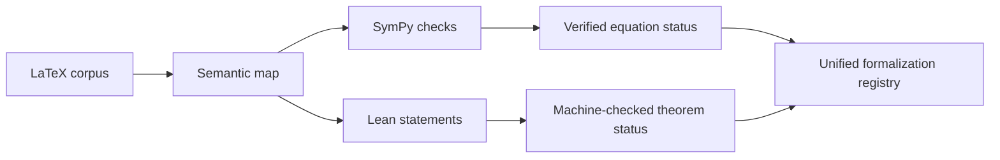

# WCT Semantic Map

> [!summary] Current corpus state
> - **76 documents**
> - **12,946 extracted occurrences**
> - **10,887 canonical objects**
> - **30,246 graph edges**
> - **3,967 equations**
> - **743 claims**
> - **781 concepts**
> - **535 derivations**
> - **221 experiments/results**
> - **281 definitions**
> - **19 predictions**
> - **15 assumptions**

## What this layer does

The semantic map is the corpus coordination layer. It records what exists, where it came from, how objects relate, and which claims, equations, assumptions, derivations, predictions, and experiments belong together.

It does **not** by itself prove that a scientific or mathematical claim is correct. Approval means the extracted object is included in the map.

## Relationship to SymPy and Lean

| Layer | Primary job | What success means |
|---|---|---|
| Semantic map | Corpus inventory, provenance, dependencies, cross-paper links | The object is located, identified, and connected |
| SymPy | Executable symbolic algebra and numerical checks | The encoded transformation or calculation executes consistently |
| Lean | Formal statements and machine-checked proofs | The conclusion follows from explicit assumptions in the formal model |



The target object chain is:

```text
source paper
→ concept or definition
→ assumptions
→ equations
→ derivation
→ claim
→ SymPy check
→ Lean theorem
→ prediction
→ experiment
```

## Current graph coverage

### Object counts

| Object type | Count |
|---|---:|
| Section | 6,087 |
| Equation | 3,967 |
| Concept | 781 |
| Claim | 743 |
| Derivation | 535 |
| Definition | 281 |
| Citation | 297 |
| Experiment | 221 |
| Prediction | 19 |
| Assumption | 15 |

### Relationship counts

| Relationship | Count |
|---|---:|
| canonicalizesTo | 12,946 |
| contains | 11,557 |
| aboutConcept | 2,449 |
| dependsOn | 1,260 |
| references | 578 |
| referencesEquation | 500 |
| defines | 497 |
| cites | 297 |
| tests | 108 |
| requiresAssumption | 50 |
| supersedes | 3 |
| followsFrom | 1 |

## Interpretation of the current state

The semantic map now has much broader coverage than either the SymPy or Lean repositories. Its main strength is discovery and coordination across the whole corpus.

The largest remaining semantic weakness is the low number of explicit `followsFrom` links relative to 535 derivations and 743 claims. The next consolidation pass should reconstruct more complete derivation chains and attach formalization IDs.

## Formalization fields to add

Every canonical equation and claim should eventually carry:

```yaml
sympy_id:
sympy_status: unmapped | encoded | executable | checked | failed
sympy_evidence:
lean_theorem:
lean_status: unmapped | stated | partial | proved | blocked
lean_file:
formal_assumptions:
empirical_status:
```

## Generated source files

The current generated source of truth is:

```text
R:\RESEARCH\wct-knowledge-workspace\build
```

Expected generated files:

- `papers.md`
- `concepts.md`
- `definitions.md`
- `equations.md`
- `claims.md`
- `predictions.md`
- `assumptions.md`
- `derivations.md`
- `experiments.md`
- `extraction-report.md`
- `knowledge.json`
- `knowledge.jsonld`
- `knowledge.ttl`
- `graph.json`

## Navigation

- [[Research Knowledge Map]]
- [[WCT Research Command Center]]
- [[WCT Research Compiler V2]]
- [[WCT Glossary]]
- [[WCT Repository Registry]]

## Refresh workflow

```powershell
$ws = "R:\RESEARCH\wct-knowledge-workspace"

cd R:\RESEARCH\wct-semantic-map
.\wctmap.ps1 scan "$ws\papers" --workspace $ws
.\wctmap.ps1 export --workspace $ws
```

Then copy the generated Markdown and machine-readable files into the vault's generated semantic-map folder.

> [!warning] Status semantics
> `approved` means included in the exported semantic map. It does not mean mathematically proved, physically validated, independently reproduced, or verified by Lean or SymPy.
