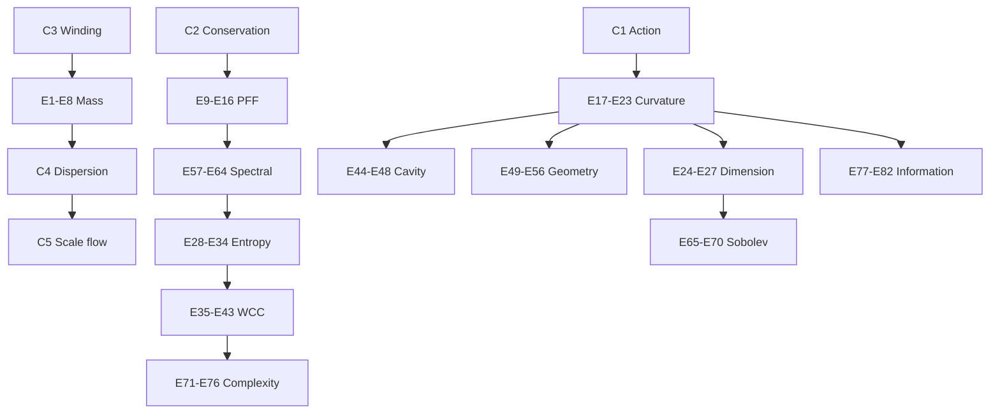
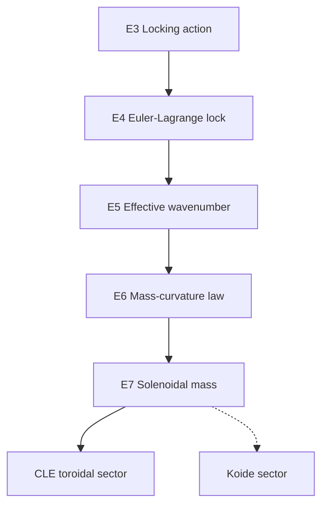
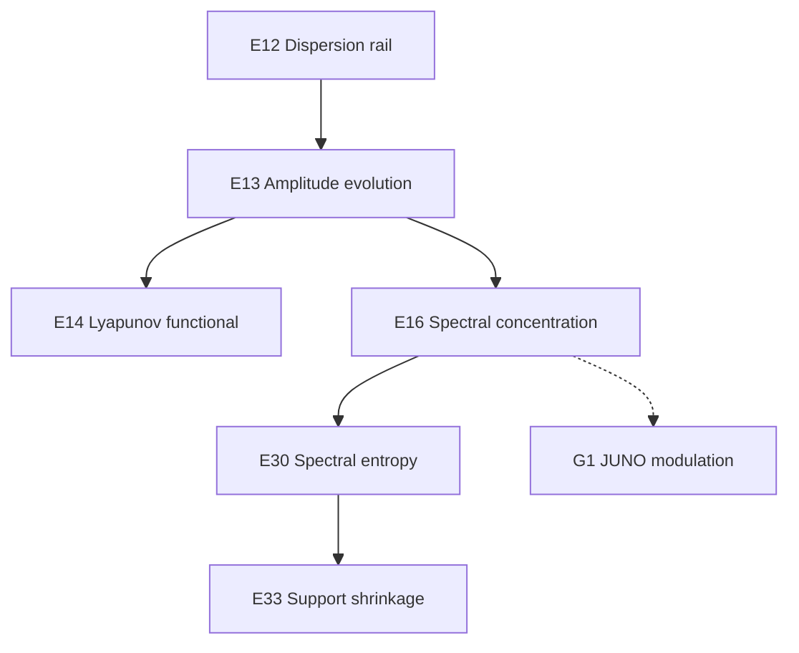

# Equation Dependency Map

> [!note]
> Solid arrows indicate direct derivation or reduction. Dashed arrows indicate structural or phenomenological connection.

## Closure to operational families

## Mass derivation

## Spectral selection

## Navigation

- [[03 Equations/00 Equations Index|Equations Index]]
