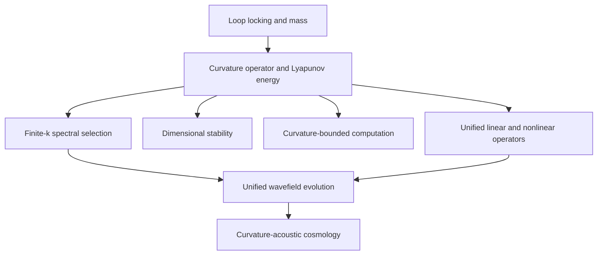

# WCT Equations Index

This folder converts the canonical WCT equation corpus into atomic Obsidian notes.

> [!summary]
> **Equation and equation-module notes:** 143  
> **Canonical E-series notes:** 83  
> **Closure equations:** 5  
> **Master equations:** 9  
> **Curvature-locking equations:** 10  
> **Topology modules:** 11  
> **Logarithmic-flow equations:** 4  
> **Cosmology equations:** 20  
> **Specialized observables:** 1

## Entry points

- [[03 Equations/00 Symbols and Notation|Symbols and Notation]]
- [[03 Equations/00 Equation Dependency Map|Equation Dependency Map]]
- [[03 Equations/00 Equation-Paper Matrix|Equation–Paper Matrix]]
- [[03 Equations/00 Canonical Corrections|Canonical Corrections]]
- [[03 Equations/08 Source Gaps/CL1-CL12 Source Status|CL1–CL12 Source Status]]

## Equation families

| Family | Notes |
|---|---:|
| [[03 Equations/01 Master and Closure Equations/Master Equations Index|Master and closure layer]] | 14 |
| [[03 Equations/02 Canonical Families/A - Rest Energy Curvature and Loop Locking/A - Family Index|A - Rest Energy, Curvature, and Loop Locking]] | 9 |
| [[03 Equations/02 Canonical Families/B - Phase-Flux Field and Cymatic Rails/B - Family Index|B - Phase-Flux Field and Cymatic Rails]] | 8 |
| [[03 Equations/02 Canonical Families/C - Curvature Feedback and Lyapunov Dynamics/C - Family Index|C - Curvature Feedback and Lyapunov Dynamics]] | 7 |
| [[03 Equations/02 Canonical Families/D - Dimensionality and Functional Bounds/D - Family Index|D - Dimensionality and Functional Bounds]] | 4 |
| [[03 Equations/02 Canonical Families/E - Alpha-Drop Entropy Reduction and Pruning/E - Family Index|E - Alpha-Drop, Entropy Reduction, and Pruning]] | 7 |
| [[03 Equations/02 Canonical Families/F - WCC Channel Capacity and P versus NP/F - Family Index|F - WCC, Channel Capacity, and P versus NP]] | 9 |
| [[03 Equations/02 Canonical Families/G - Resonant Cavity and Tokamak Scaling/G - Family Index|G - Resonant Cavity and Tokamak Scaling]] | 5 |
| [[03 Equations/02 Canonical Families/H - Geometry of Resonance Extensions/H - Family Index|H - Geometry-of-Resonance Extensions]] | 8 |
| [[03 Equations/02 Canonical Families/I - Self-Emergent Fourier Cymatics/I - Family Index|I - Self-Emergent Fourier Cymatics]] | 8 |
| [[03 Equations/02 Canonical Families/J - Dimensionality Bounds and Sobolev Structure/J - Family Index|J - Dimensionality Bounds and Sobolev Structure]] | 6 |
| [[03 Equations/02 Canonical Families/K - P versus NP Computational Bounds/K - Family Index|K - P versus NP Computational Bounds]] | 6 |
| [[03 Equations/02 Canonical Families/L - Entropy and Information Dynamics/L - Family Index|L - Entropy and Information Dynamics]] | 6 |
| [[03 Equations/03 Curvature Locking/Curvature Locking Index|Curvature locking]] | 10 |
| [[03 Equations/04 Topology and Spectral Emergence/Topology Equation Index|Topology and spectral emergence]] | 11 |
| [[03 Equations/05 Logarithmic Curvature Flow/Logarithmic Flow Index|Logarithmic curvature flow]] | 4 |
| [[03 Equations/06 Cosmology/Cosmology Equation Index|Cosmology]] | 20 |
| [[03 Equations/07 Specialized Observables/Specialized Observables Index|Specialized observables]] | 1 |

## Master architecture

## Source files

- [[03 Equations/90 Source/EQUATIONS|EQUATIONS.md]]
- [[03 Equations/90 Source/MASTER_EQUATIONS|MASTER_EQUATIONS.md]]

## Status rule

Each note preserves the supplied source statement. The folder does not silently repair or validate mathematical claims. Canonical corrections and known source gaps are recorded separately.
